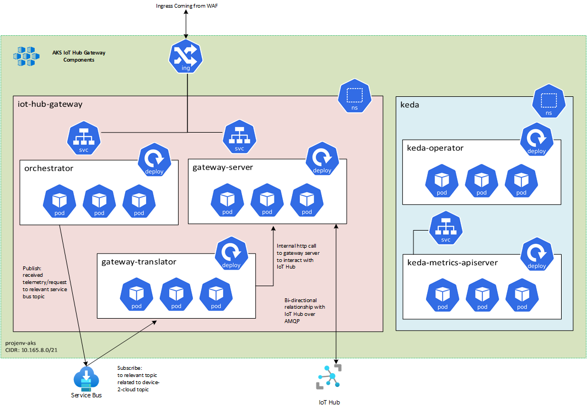

# IoT-Hub-Gateway
Cloud native IoT Hub Gateway implementation to support devices that can't connect directly to IoT Hub supported protocols

## Architecture

### Azure Architecture


### AKS Internal Architecture


## Azure Functions

Currently the project is developed using version 3.0 of Azure Functions (Azure Functions Core Tools v3.0.3442)

```bash

# Installing the tools on Ubuntu
sudo apt-get install azure-functions-core-tools-3

```

To manually build the docker file locally you can use:

```bash
docker build -t gateway-orchestrator:v1.0.0 .
```

To generate Kubernetes deployment file, you can also use (you need to replace the container registry url)

```bash

# This will generate ready to deploy manifest with all secrets and services for that particular function
func kubernetes deploy --name gateway-orchestrator --registry <container-registry-username> --dry-run

```

## KEDA

I'm using [KEDA](https://keda.sh) to automatically scale out the gateway-translator based on the lenght of the Service Bus topic.

Installing KEDA on the AKS cluster using helm v3 (just ensure the current kubectl context is set to your target AKS cluster and Helm tools are installed)

```bash

helm repo add kedacore https://kedacore.github.io/charts
helm repo update
kubectl create namespace keda
helm install keda kedacore/keda --namespace keda

# Uninstall
# helm uninstall keda -n keda

```

# Deployment procedure

## Main components
Main components of the project consists of the following:
- Gateway Orchestrator: an HTTP service that provides entry point to the platform and its job to publish a message to relevant service bus topic for other services to consume
- Gateway Translator: a service that subscribe to "d2c-messages" topic and send these messages to Gateway Server to be posted to IoT Hub. It can include any transformation logic as well
- Gateway Server: an HTTP service that post Device-2-Cloud messages among other things related to acting as IoT Hub gateway (like direct method invocation and Cloud-2-Device messaging)

## Azure services required
To deploy the platform, you will need the following Azure Services provisioned:
- AKS Cluster with appropriate size (load test done with 20K concurrent devices with 8 D8s worker nodes)
- Service Bus Name Space (standard or premium based on expected load) with at least one topic named [d2c-messages] and subscription named [d2c-messages-sub]
- IoT Hub with appropriate scale (load test done with 5 units of S2 but experienced several throttling due to reaching the limits. If this a problem consider using S3 instead)

## AKS Deployment
Each service containers a folder called deployment, underneath it all the required YAML manifest for AKS.
You need to make some adjustments to some of the YAML files to reflect you specific environment.

Specific instructions are specified in each project in a bash script named [deployment-cmds.sh]. Follow these instructions to push each service container to Azure Container Registry and deploy then each service to AKS

# Testing
In order to test the functionality of the server, you can use something as simple as [Postman]. 
Included in the project a Postman template that can be imported for sample requests to target the deployment.
